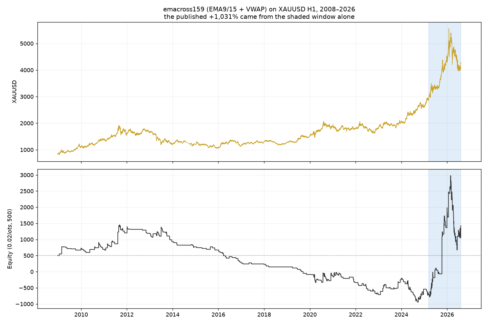
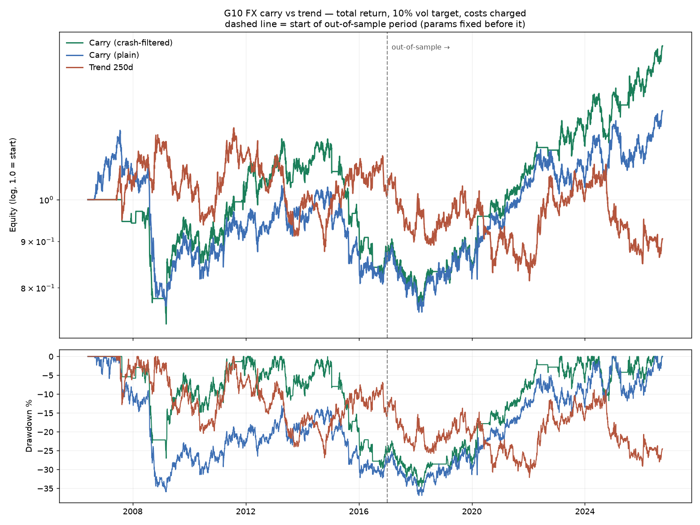

# FX & Gold Strategy Research — Findings

**Date:** 2026-09-30 · **Scope:** 15 FX pairs (Yahoo daily, 1996/2003→2026) +
XAUUSD (Doo Prime broker data, 2008-12→2026, M1→D1)

---

## TL;DR

1. **The existing XAUUSD EMA-cross result does not generalise.** Its reported
   +1,031% came from a 17-month window inside a gold bull market. Over the
   broker's full 17.6 years of H1 data the same rules net **+$926 with a
   −164.9% drawdown** — account death — and are profitable in only **4 of 18
   years**.
2. **No classic technical strategy survived out-of-sample.** Five families ×
   16 markets: best OOS Sharpe **0.14** against a luck bar of **0.57**.
3. **Carry is the one thing with a real signature** — the right economic
   mechanism, near-zero cost sensitivity, 80% positive years out-of-sample.
   But at OOS Sharpe **0.67** vs a search-adjusted bar of **0.86**, it is
   *promising, not proven*.
4. **An engine bug was inflating results** until caught: trailing stops were
   being set from the current bar's high, then tested against that same bar's
   low. Fixed and asserted against.

---

## 1. The gold strategy is a regime artifact

Replication first — the port reproduces the published M5 run closely, landing
slightly *worse* because the look-ahead fix and same-bar stop-outs both cost:

| | Reported | Replicated | Δ |
|---|---|---|---|
| Trades | 306 | 311 | +5 |
| Win rate | 29.4% | 28.6% | −0.8pp |
| Profit factor | 1.81 | 1.72 | −0.09 |
| Net | +$5,155.75 | +$4,742.17 | −$413.58 |

Extending the *same rules* across every timeframe the broker serves:

| TF | Sample | Trades | PF | Sharpe | Net |
|---|---|---|---|---|---|
| M15 | 2022+ (4.2y) | 298 | 1.40 | 0.85 | +$2,813 |
| M30 | 2018+ (8.5y) | 424 | 1.20 | −0.49 | +$2,377 |
| H4 | 2008+ (17.6y) | 336 | 1.14 | 0.39 | +$1,619 |
| **H1** | **2008+ (17.6y)** | **458** | **1.07** | **−0.10** | **+$926** |

**The edge weakens monotonically as the sample lengthens.** On H1:

- Profitable in **4 of 18 years**
- **2025 alone contributed +$2,381** of the +$926 total. Excluding it, the
  strategy loses ~$1,455. Gold returned **+64.6%** that year
- Removing the best 5 trades → **−$2,285**; best 20 → **−$6,155**
- Equity falls from +$1,400 (2012) to −$900 (2025) before the 2025 spike —
  the $500 account is wiped out long before the good part arrives

**Cost caveat.** `loader.COSTS` was flagged uncalibrated, correctly. The
broker's own `spread` column reads **0** for 2008–09 and 2013–17 and a constant
**50** for 2010–12 — artifacts, not quotes. Only 2018+ is real, at ~6 points
(**$12/lot round turn**, vs the $28 assumed). Commission cannot be calibrated
without MT5 deal history, so it was swept: at $75/lot, average R goes negative.

---

## 2. No technical strategy survived out-of-sample

Parameters chosen **once per family** on pooled 2003–2016 data across all 16
markets (no per-market tuning), then run untouched on 2017–2026:

| Family | IS Sharpe | OOS Sharpe | Markets profitable |
|---|---|---|---|
| ATR breakout | 0.65 | **−0.01** | 8/16 |
| Donchian | 0.38 | **0.08** | 8/16 |
| TSMOM | 0.15 | **−0.52** | 6/16 |
| EMA cross | 0.11 | **0.14** | 6/16 |
| Bollinger reversion | −0.03 | **−0.19** | 9/16 |

34 trials ⇒ a worthless strategy reaches OOS Sharpe **0.57** by luck. Best
observed: **0.14**. Bootstrap CI **[−0.73, 0.51]**, P(Sharpe>0) = 0.64.

---

## 3. Carry is the only credible candidate

Tested properly as **total return** — spot move *plus* interest differential —
with 10% volatility targeting, monthly rebalancing and costs on turnover.

| Strategy | Full Sharpe | IS Sharpe | OOS Sharpe | OOS CAGR | OOS maxDD | OOS +years |
|---|---|---|---|---|---|---|
| **Carry, crash-filtered** | **0.25** | −0.09 | **0.67** | **5.61%** | −13.0% | **80%** |
| Carry, plain | 0.16 | −0.10 | 0.45 | 4.01% | −13.0% | 60% |
| Carry, dollar-neutral | 0.03 | −0.29 | 0.39 | 3.51% | −18.1% | 60% |
| Trend 250d | 0.00 | 0.06 | −0.08 | −1.37% | −23.1% | 40% |
| Trend 120d | −0.13 | 0.33 | **−0.61** | −6.62% | −49.6% | 10% |

Why carry is different from everything else here:

- **The mechanism checks out.** Spot-only Sharpe **−0.14**; spot+carry **+0.16**.
  The return comes from the interest differential, as the literature says — not
  from predicting direction.
- **It did *worse* in-sample than out.** The opposite of an overfit signature.
- **Costs are irrelevant to it** — drag of 0.00 Sharpe, because monthly
  rebalancing on 7 pairs barely trades.
- **The crash filter is economically motivated, not searched**: carry crashes
  coincide with volatility spikes, so exposure is cut when trailing basket vol
  sits in its top quintile. It improves both full-sample *and* OOS.

### But it does not clear the honest bar

Across the whole study — **43 trials**, cross-trial Sharpe sd 0.388 — a
worthless strategy reaches OOS Sharpe **0.86** by luck. Carry's 0.67 is below
that. Its own bootstrap CI is **[0.09, 1.23]**, P(Sharpe>0) = 0.989, which is
independent of the search, so the fair summary is *probably real, modest, and
unproven*.

### The risk nobody should skip

- Full-sample max drawdown **−36.9%** (2008 carry crash); −24.5% in 2008 alone
- 3-year rolling Sharpe is positive only **66%** of the time, above 0.5 only
  **28%**; worst 3-year Sharpe **−0.98**
- **Carry needs rate dispersion.** It earned nothing 2010–2016 when every
  central bank sat at zero. Its post-2020 performance tracks the return of
  rate differentials, and would fade if policy converges again

---

## 4. Methodology

- Signal on bar close → execute next bar open. Never same-bar.
- Trailing stops use prior-bar information only *(this was a real bug)*.
- Bars that could hit both stop and target resolve as the **stop**.
- Orders gapping through their level fill at the **open**.
- Half-turn spread charged on entry *and* exit, plus commission and swap.
- Parameters fixed on in-sample data, then run untouched out-of-sample.
- Every trial counted; multiple-testing bar reported next to every result.
- 2,991 bad bars removed across 15 pairs (inverted ranges, frozen weekend
  bars, reverting decimal-shift spikes).

## 5. What I'd do next

1. **Calibrate commission** from real MT5 deal history. It's the largest
   remaining unknown in the gold numbers, and it needs Windows.
2. **Widen the carry universe** to EM (MXN, ZAR, TRY are already cached).
   Carry is strongest where differentials are widest — with fatter crash risk.
3. **Test carry on longer history** (pre-2006) to see it through more than one
   full rate cycle.
4. **Do not deploy the EMA-cross system.** On the evidence, its live results
   will track gold's trend, not an edge.
