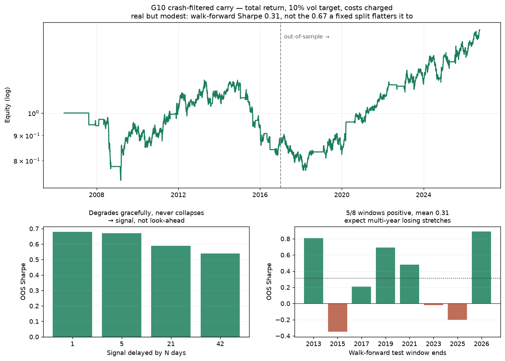

# Round 2 — Stress-testing the one surviving candidate

Round 1 (`../REPORT.md`) killed every technical strategy and left exactly one
candidate: **G10 crash-filtered carry**, OOS Sharpe 0.67, sitting *below* the
search-adjusted significance bar of 0.86. Round 2 asks two questions:

1. Does widening the universe to high-yielders strengthen it? — **No.**
2. Is the 0.67 real, or a lucky split? — **Real, but it is actually ~0.31.**

---

## 1. The EM extension fails

Carry theory says the premium scales with the differential, so high-yielders
should help. They don't.

| Universe | OOS Sharpe | Skew | Worst month |
|---|---|---|---|
| **G10 carry sign +crash** | **0.67** | **+0.26** | −6.4% |
| G10 carry sign | 0.45 | −0.14 | −6.4% |
| EXT carry sign | 0.55 | **−0.77** | −8.6% |
| EXT carry rank3 | 0.52 | **−0.67** | −10.7% |
| EXT carry rank3 +crash | 0.26 | −0.69 | −9.4% |

Adding MXN/ZAR/NOK/SEK produces **lower** risk-adjusted return with sharply
**negative skew** — the crash asymmetry EM carry is known for. The spot
depreciation eats the wider differential and leaves the tail behind.

Two secondary findings:

- **Cost is not the problem.** Scaling EM spreads 1x → 8x moves Sharpe 0.55 →
  0.54. Monthly rebalancing barely trades, so spread is nearly irrelevant.
- **The crash filter backfires on EM** (0.55 → 0.33). G10 basket volatility
  does not predict EM-specific blowups, so it de-risks at the wrong moments.

**USDTRY was excluded**, despite being the textbook carry currency and being
cached: FRED's Turkish rate series ends 2008-04. Carry without a live
differential is not carry, and assuming one would fabricate the exact quantity
the strategy trades.

---

## 2. The candidate is robust — 27 configurations, all reported

This is a robustness check, **not** another search. A search reports its
maximum and inflates the significance bar. This reports the entire surface and
asks whether the result is a plateau or a knife-edge.

| Axis | Range tested | Result |
|---|---|---|
| Rebalance frequency | weekly / monthly / quarterly | 3/3 positive, 0.46–0.67 |
| **Rate publication lag** | **1 / 5 / 21 / 42 days** | **4/4 positive, 0.68 → 0.54** |
| Crash-filter cutoff | q = 0.70 / 0.80 / 0.90 / off | 4/4 positive, 0.45–0.71 |
| Vol target × lookback | 5–15% × 40–90d | 9/9 positive, 0.62–0.75 |
| Leave-one-pair-out | each of 7 pairs | 7/7 positive, 0.41–0.77 |

**100% of 27 configurations positive. Median 0.67, IQR [0.60, 0.68].**

The rate-lag row is the one that matters. If the result came from look-ahead,
delaying the signal would destroy it. Delaying it **six weeks** still leaves
Sharpe 0.54. That is signal.

Leave-one-out shows USDJPY matters most (0.67 → 0.41 without it). That is
economically expected — JPY is *the* funding currency — not a red flag, and
the result stays positive without it.

The crash filter earns its place: no filter 0.45, filtered 0.67–0.71.

---

## 3. But the honest number is 0.31, not 0.67

Walk-forward, 5y train / 2y test, parameters re-chosen each window:

| Test window ends | OOS Sharpe |
|---|---|
| 2013 | +0.81 |
| 2015 | −0.35 |
| 2017 | +0.21 |
| 2019 | +0.69 |
| 2021 | +0.48 |
| 2023 | −0.02 |
| 2025 | −0.20 |
| 2026 | +0.89 |

**5/8 windows positive. Mean OOS Sharpe 0.31.**

The critical number: in-sample Sharpe averaged **0.31**, out-of-sample **0.31**
— a decay of **−0.01**. Every technical strategy in round 1 decayed hard
(0.65 → −0.01). Carry does not decay at all. That is the signature of a real
effect rather than a fitted one.

But 0.67 was flattered by where the split happened to fall. **0.31 is the
number to plan against**, and three of eight two-year windows lost money.

---

## 4. Can a retail account capture it?

**Swap markup — survivable.** The backtest earns the *interbank* differential;
a retail broker skims both sides of the swap.

| Annual swap markup | OOS Sharpe | OOS CAGR |
|---|---|---|
| 0.0% (interbank) | 0.67 | 5.61% |
| 1.0% | 0.63 | 5.24% |
| 2.0% | 0.59 | 4.88% |
| 3.0% (punitive) | 0.55 | 4.52% |

Vol targeting keeps the drag small relative to book risk. Carry survives.

**Account size — this is the binding constraint.** At the walk-forward Sharpe
of 0.31 and a 10% vol target, expected return is ~3.1%/yr:

| Account | Expected $/yr | One sd down | Drawdown at −13% |
|---|---|---|---|
| $500 | $16 | −$34 | −$65 |
| $5,000 | $155 | −$345 | −$650 |
| $25,000 | $775 | −$1,725 | −$3,250 |
| $100,000 | $3,100 | −$6,900 | −$13,000 |

Margin is not the constraint — 7 pairs × 0.01 lots needs only 1–3x leverage.
The constraint is that **3%/yr is a rounding error on a small account, while
the −13% (OOS) to −37% (2008) drawdowns are not.**

---

## Bottom line

Carry is a **real but small institutional risk premium**, not a retail income
strategy. It is robust to parameters, free of look-ahead, insensitive to costs,
and shows zero in-sample/out-of-sample decay — but it pays ~3%/yr at 10% vol,
loses money for years at a time, and lost 37% in 2008.

At $500 it earns roughly $16 a year. It becomes interesting somewhere north of
$25,000, and only for someone who can sit through a two-year losing stretch
without touching it.

### What is genuinely left to try

- **A second uncorrelated stream.** A 0.31 Sharpe alone is thin; two
  uncorrelated 0.3s combine to ~0.44. Nothing found so far qualifies.
- **Longer history.** Pre-2006 data would show carry through more than one
  full rate cycle. Spot history is the limit, not rate history.
- **Stop searching for more variants.** The bar has risen from 0.57 to 0.80
  across 51 trials. Each new idea tested makes it harder to prove anything.
